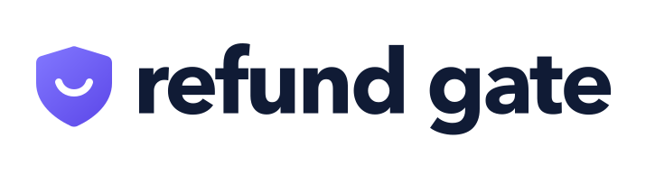
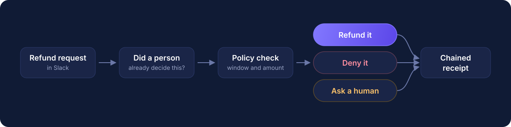

`bash ci/check.sh` grades this project. Everything below is for people.

<p align="center">
  <picture>
    <source media="(prefers-color-scheme: dark)" srcset=".github/logo-dark.svg">
    
  </picture>
</p>

<p align="center"><strong>Follow the money.</strong> Humans approve. Agents prove.</p>

<p align="center">
  <a href="../../actions/workflows/ci.yml"></a>
  
  
  
  
</p>

---

RefundGate is a refund assistant that lives in Slack, where refunds already get approved. A refund request comes in. The assistant checks the policy and does one of three things: refunds it, denies it, or asks a person with one tap.

Every decision gets a receipt. Every receipt is locked to the one before it. Every time a person says yes or no, that answer becomes a rule the assistant follows next time, with that person's name on it.

## The problem

Your company already makes these calls every day. Marketing says "no refunds on that promo" in an email. A manager says "fine, approve it" in Slack. Then a bot shows up, reads none of it, and refunds the order anyway. Nobody signed it. Nobody can prove why. And it does it again tomorrow, because it learned nothing.

## What RefundGate does instead

<p align="center"></p>

1. A refund request lands in Slack.
2. The assistant checks: did a person already decide a case like this? An email, a past approval, a past denial.
3. Yes: it cites that person and acts. No re-asking.
4. No: it follows the policy. Small and in-window refunds go through. Big or unusual ones post a card and wait for a human tap.
5. The tap does three things at once: pays the refund, writes the receipt, and becomes the next rule.
6. A manager can flip one switch and the assistant can only propose, never pay.

Money moves only when a person said yes, now or before. Never on the bot's word alone.

## Why this is not a chatbot

A chatbot has no second person in the room and no memory of the last one. RefundGate lives where the second person already is, keeps every answer they ever gave, and can prove who said what.

## Why you can trust the receipts

The same rules that run the product built the product.

- Every stage of this build was signed by a named human after the automated checks passed. The sign-off refuses to run unless a real person is at the keyboard. A machine cannot sign for you.
- Every human ruling the assistant relies on is recorded and cannot be changed after the fact.
- Every refund, denial, or proposal is written to a ledger where each line depends on the previous one. Change one old line and everything after it breaks.

No cover-ups. No eighteen-minute gap.

## What is real in this demo

Real: Slack, the approval card, the decisions, the receipts, the sign-offs, the learning. Not real: the payment. The refund produces a receipt number but no money moves. A real payment provider plugs in without changing the approval logic.

## Run it

```
python3.12 -m venv .venv && .venv/bin/pip install pytest && source .venv/bin/activate
printf '#!/bin/sh\nexec "$(git rev-parse --show-toplevel)/ci/check.sh"\n' > .git/hooks/pre-commit
chmod +x .git/hooks/pre-commit ci/*.sh
bash ci/check.sh
```

`bash ci/check.sh` is the only definition of green. It runs as the pre-commit hook, in CI, and inside every model's loop before it may claim anything. [STAGES.md](STAGES.md) is the build contract: what may be touched at each stage, and what green means. Only the human amends it.

## Built at

AI Tinkerers, Agents Everywhere, New York, September 12, 2026. Team No Vibes.

The Slack surface runs on CopilotKit Channels. Models from more than one lab built and reviewed this project under the same checker, and each one's name is on its own work. Brand assets come from [refund-gate-logo-kit](https://github.com/team-no-vibes/refund-gate-logo-kit).

Every commit on a branch carries two trailers, `Model: <model>` and `Task: <task_id>`,
and the branch adds at most `loc_cap` lines against origin/main. CI is RED without them.

